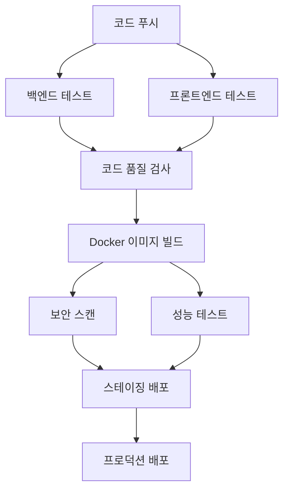

# TofuMaker CI/CD 파이프라인 가이드

## 개요

TofuMaker 프로젝트는 GitHub Actions를 사용하여 완전 자동화된 CI/CD 파이프라인을 구축했습니다. 이 문서는 파이프라인의 구조, 설정 방법, 운영 가이드를 제공합니다.

## 파이프라인 구조

### 워크플로우 개요



### 주요 단계

1. **테스트 단계**
   - 백엔드: Maven 테스트, JUnit
   - 프론트엔드: npm 테스트, Jest

2. **코드 품질 검사**
   - SonarQube 정적 분석
   - 코드 커버리지 측정

3. **빌드 및 패키징**
   - Docker 이미지 빌드
   - GitHub Container Registry 푸시

4. **보안 검사**
   - Trivy 취약점 스캔
   - 의존성 보안 검사

5. **성능 테스트**
   - Apache Bench 부하 테스트
   - 응답 시간 및 처리량 측정

6. **배포**
   - 스테이징 환경 (develop 브랜치)
   - 프로덕션 환경 (main 브랜치)

## 환경 설정

### GitHub Secrets 설정

다음 시크릿을 GitHub 리포지토리에 설정해야 합니다:

#### 스테이징 환경
```
STAGING_POSTGRES_PASSWORD=your_staging_db_password
STAGING_REDIS_PASSWORD=your_staging_redis_password
STAGING_JWT_SECRET=your_staging_jwt_secret_minimum_32_chars
STAGING_OPENSTACK_AUTH_URL=http://your-staging-openstack:5000/v3
STAGING_OPENSTACK_USERNAME=staging_user
STAGING_OPENSTACK_PASSWORD=staging_openstack_password
STAGING_OPENSTACK_PROJECT_NAME=staging_project
```

#### 프로덕션 환경
```
PRODUCTION_POSTGRES_PASSWORD=your_production_db_password
PRODUCTION_REDIS_PASSWORD=your_production_redis_password
PRODUCTION_JWT_SECRET=your_production_jwt_secret_minimum_64_chars
PRODUCTION_OPENSTACK_AUTH_URL=https://your-production-openstack:5000/v3
PRODUCTION_OPENSTACK_USERNAME=production_user
PRODUCTION_OPENSTACK_PASSWORD=production_openstack_password
PRODUCTION_OPENSTACK_PROJECT_NAME=production_project
```

#### 알림 및 모니터링
```
SLACK_WEBHOOK_URL=https://hooks.slack.com/services/YOUR/SLACK/WEBHOOK
MONITORING_WEBHOOK_URL=https://your-monitoring-service.com/webhook
GRAFANA_PASSWORD=your_grafana_admin_password
```

### 환경 파일 설정

배포 서버에서 다음 환경 파일을 설정하세요:

1. **스테이징**: `.env.staging`
2. **프로덕션**: `.env.production`

템플릿 파일을 참조하여 실제 값으로 설정하세요:
- `scripts/deploy/env-template-staging.txt`
- `scripts/deploy/env-template-production.txt`

## 브랜치 전략

### Git Flow 기반 브랜치 전략

- **main**: 프로덕션 배포 브랜치
- **develop**: 스테이징 배포 브랜치
- **feature/***: 기능 개발 브랜치
- **hotfix/***: 긴급 수정 브랜치

### 배포 트리거

- **develop 브랜치 푸시** → 스테이징 환경 자동 배포
- **main 브랜치 푸시** → 프로덕션 환경 자동 배포
- **Pull Request** → 테스트 및 코드 품질 검사만 실행

## 모니터링 및 알림

### 모니터링 스택

1. **Prometheus**: 메트릭 수집
   - 접속: http://localhost:9090
   - Spring Boot Actuator 메트릭 수집

2. **Grafana**: 대시보드
   - 접속: http://localhost:3000
   - 기본 계정: admin / admin123

3. **Alertmanager**: 알림 관리
   - 접속: http://localhost:9093
   - Slack 알림 연동

### 주요 메트릭

- **애플리케이션 메트릭**
  - 응답 시간 (95th percentile < 2초)
  - 에러율 (< 1%)
  - 처리량 (RPS)

- **시스템 메트릭**
  - CPU 사용률 (< 80%)
  - 메모리 사용률 (< 85%)
  - 디스크 사용률 (< 85%)

- **데이터베이스 메트릭**
  - 연결 풀 사용률
  - 쿼리 응답 시간
  - 데드락 발생 횟수

## 배포 프로세스

### 스테이징 배포

1. **자동 트리거**: develop 브랜치에 푸시
2. **배포 단계**:
   ```bash
   # 환경 변수 설정
   # Docker 이미지 풀
   # 기존 컨테이너 중지
   # 새 컨테이너 시작
   # 헬스 체크
   ```

3. **확인 사항**:
   - 애플리케이션 정상 시작
   - 데이터베이스 연결 확인
   - API 엔드포인트 응답 확인

### 프로덕션 배포

1. **자동 트리거**: main 브랜치에 푸시
2. **배포 단계**:
   ```bash
   # 데이터베이스 백업
   # 롤링 업데이트
   # 헬스 체크
   # 성능 검증
   ```

3. **롤백 절차**:
   - 자동 롤백: 헬스 체크 실패 시
   - 수동 롤백: `./scripts/deploy/rollback-production.sh`

## 성능 테스트

### 자동 성능 테스트

CI/CD 파이프라인에서 자동으로 실행되는 성능 테스트:

```bash
# 기본 부하 테스트
./scripts/performance/load-test.sh http://localhost:8080 10 1000 60

# 스파이크 테스트
./scripts/performance/load-test.sh http://localhost:8080 50 500 30
```

### 성능 기준

- **응답 시간**: 평균 < 1초, 95th percentile < 2초
- **처리량**: 최소 100 RPS
- **에러율**: < 1%
- **동시 사용자**: 50명 이상 지원

### 성능 최적화 가이드

1. **데이터베이스 최적화**
   - 인덱스 최적화
   - 쿼리 튜닝
   - 연결 풀 설정

2. **캐시 활용**
   - Redis 캐시 전략
   - HTTP 캐시 헤더
   - CDN 활용

3. **애플리케이션 최적화**
   - JVM 튜닝
   - 스레드 풀 설정
   - 비동기 처리

## 보안 가이드

### 보안 스캔

1. **Trivy 취약점 스캔**
   - Docker 이미지 스캔
   - 의존성 취약점 검사
   - 자동 보고서 생성

2. **보안 설정**
   - HTTPS 강제 적용
   - 보안 헤더 설정
   - Rate Limiting

### 보안 체크리스트

- [ ] 모든 시크릿이 GitHub Secrets에 저장됨
- [ ] 프로덕션 환경에서 강력한 패스워드 사용
- [ ] SSL/TLS 인증서 설정
- [ ] 방화벽 규칙 설정
- [ ] 정기적인 보안 업데이트

## 트러블슈팅

### 일반적인 문제

1. **배포 실패**
   ```bash
   # 로그 확인
   docker logs tofumaker-backend-prod
   docker logs tofumaker-frontend-prod
   
   # 헬스 체크
   curl http://localhost:8083/actuator/health
   ```

2. **데이터베이스 연결 실패**
   ```bash
   # PostgreSQL 상태 확인
   docker exec tofumaker-postgres-prod pg_isready
   
   # 연결 테스트
   docker exec -it tofumaker-postgres-prod psql -U tofumaker_user -d tofumaker_production
   ```

3. **성능 문제**
   ```bash
   # 메트릭 확인
   curl http://localhost:8083/actuator/metrics
   
   # 시스템 리소스 확인
   docker stats
   ```

### 로그 위치

- **애플리케이션 로그**: `/var/log/tofumaker/`
- **Nginx 로그**: `/var/log/nginx/`
- **Docker 로그**: `docker logs <container_name>`

## 운영 체크리스트

### 일일 점검

- [ ] 애플리케이션 상태 확인
- [ ] 에러 로그 검토
- [ ] 성능 메트릭 확인
- [ ] 디스크 사용량 확인

### 주간 점검

- [ ] 보안 업데이트 확인
- [ ] 백업 상태 확인
- [ ] 성능 트렌드 분석
- [ ] 용량 계획 검토

### 월간 점검

- [ ] 전체 시스템 성능 리뷰
- [ ] 보안 감사
- [ ] 재해 복구 테스트
- [ ] 문서 업데이트

## 연락처 및 지원

- **개발팀**: dev@tofumaker.com
- **운영팀**: ops@tofumaker.com
- **긴급 상황**: +82-10-xxxx-xxxx

## 참고 자료

- [GitHub Actions 문서](https://docs.github.com/en/actions)
- [Docker 문서](https://docs.docker.com/)
- [Prometheus 문서](https://prometheus.io/docs/)
- [Grafana 문서](https://grafana.com/docs/) 